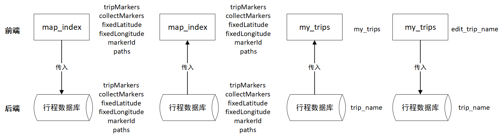

<!-- TOC -->

- [1. 系统结构](#1-系统结构)
    - [1.1. 前端系统结构](#11-前端系统结构)
      - [1.1.1. 地图画布界面模块](#111-地图画布界面模块)
    - [1.2. 后端系统结构](#12-后端系统结构)
    - [1.3. 系统结构图](#13-系统结构图)
    - [1.4. 系统类图](#14-系统类图)
    - [1.5. 关键数据结构定义](#15-关键数据结构定义)
        - [1.5.1. 前端数据结构](#151-前端数据结构)
        - [1.5.2. 地点数据结构设计](#152-地点数据结构设计)
        - [1.5.3. 绘画路径数据结构设计](#153-绘画路径数据结构设计)
        - [1.5.4. 邀请码数据项结构设计](#154-邀请码数据项结构设计)
        - [1.5.7. 数据关联结构设计](#157-数据关联结构设计)
    - [1.6. 关键算法设计](#16-关键算法设计)
        - [1.6.1. 画布绑定地图](#161-画布绑定地图)
        - [1.6.2. API接口选择](#162-api接口选择)
    - [1.7. 数据管理说明](#17-数据管理说明)
        - [1.7.1. 使用数据库概述](#171-使用数据库概述)

<!-- /TOC -->

<a id="markdown-1-系统结构" name="1-系统结构"></a>
# 1. 系统结构
<a id="markdown-11-前端系统结构" name="11-前端系统结构"></a>
## 1.1. 前端系统结构
==以下这些都需要改，补充前端其他界面信息==

前端系统分为 个模块：
1. 地图画布界面模块（包含4个子模块，见1.1.1节）。主要功能：编辑行程地点，在地图上进行绘画记录。
2. 行程列表显示界面模块。主要功能：我的行程列表显示，创建行程，修改行程名称。
    
==以上这些都需要改，补充前端其他界面信息==
<a id="markdown-111-地图画布界面模块" name="111-地图画布界面模块"></a>
### 1.1.1 地图画布界面模块
地图画布界面模块共分为4个子模块：
1. 地图画布主界面模块。主要功能：展示已加入当前行程的地点标记，展示当前行程的绘画，提供能导航至相应功能界面（选择地点、绘画、日程）的导航工具栏。
2. 选择地点界面模块。主要功能：选择行程中心地点，根据关键词搜索推荐周边地点，通过点击地图或精确搜索自定义添加地点，将地点添加至当前行程，收藏地点，了解地点详情，以列表形式分类显示地点。
3. 绘画界面模块。主要功能：显示已加入当前行程的地点标记，在地图上绘画（拖动或缩放地图时，绘画会跟随地图移动），切换画笔颜色、粗细，使用橡皮擦擦除绘画。
4. 日程界面模块。主要功能：显示已加入当前行程的地点标记，对任意两个行程地点进行路线规划（支持多交通工具：驾车、步行、自行车、电动车，可显示规划路线、距离、时间），设定行程地点所属日程，设定行程地点在所属日程中的游览顺序，删除行程地点。

<a id="markdown-12-后端系统结构" name="12-后端系统结构"></a>
## 1.2. 后端系统结构

==待改aaaaaaaaaaaaaaaaaaaaaaaa==

后端系统的功能模块分为用户账号模块，主页课程模块，课程模块，讨论模块。个人中心模块。
1. 其中用户账号模块包括用户账号注册，用户账号登陆子模块。
    1. 用户账号注册模块实现用户注册页面的展示，用户创建账号的数据提交与收取，数据检验和数据入库，以及前端反馈等功能。
    对应的接口为register函数，通过'/register'访问，可接受前端传入的post数据，进行数据结构检错后调用数据库进行用户数据库的更新，并向前端传递对应的响应信息。
    2. 用户账号登陆子模块实现用户登录页面的展示，用户登录的数据提交与收取，数据检验和数据入库，以及前端反馈等功能。
    对应的接口为login函数，通过'/login'访问，可接受前端传入的post数据，进行数据结构检错后调用数据库进行数据的查找，并向前端传递对应的响应信息。
2. 主页课程模块包括选课，退课模块，课程显示模块，登录注销模块，live2d模块等子模块。
	1. 选课，退课模块实现了特定用户对某一个课程的选课，退课的功能。
	对应的接口为message1，通过用户前 吧端传过来的操作，完成对应选课退选操作后，将对应数据更新到数据库中。并向前端传递操作消息。
	2. 课程显示模块实现了从数据库中加载所有的课程信息并显示，并且可以根据对应的分类符分类显示课程的功能。还能根据数据库进行实时的课程页面更新（需要刷新页面）。还提供了跳转课程更多信息页面的跳转链接。
	对应的接口为index，能够展示当前所有的课程以及其信息，并且能够根据对应的按钮实现对应的功能。
	3. 登陆注销模块实现了课程主页的快速登陆和注销的功能。
	对应的接口为message2:实现用户注销功能。
	4. live2d模块实现了网站的live2d美化功能。
	此部分由网页js部分实现。
3. 课程模块包括课程简介模块，课程上传模块，课程评价模块等子模块。
	1. 课程简介模块实现了根据对应课程显示对应课程的对应信息功能。
	对应接口为class_info2()：通过前端的post信息生成特定的url以供class_info函数使用。
和class_info(id): 根据传入的特定课程的url返回对应渲染页面。
	1. 课程上传模块实现了老师用户发布新的课程功能。
	对应的接口为classinfo()：从前端获取信息，将其送入数据库中，实现老师发布新课程功能。
	2. 课程评价实现了可查看特定课程的评价区，并只有选择过该课程的学生才能进行评价，评价按时间先后排序。
	对应接口为message_x()和class_comments(course_id)，分别完成特定的课程url生成，和特定课程评价区的实现。
1. 讨论模块包括讨论区模块子模块。
	1. 讨论区实现了能够在其中自有讨论的功能，顺序按时间排序。
	对应接口为class_discussion()，从数据库中读取当前所有讨论的信息，并能够从前端向数据库进行信息的更新，实现自由讨论区的功能。
2. 个人中心模块包括学生个人中心模块，老师个人中心模块等子模块。
	1. 学生个人中心模块实现了可按照特定学生的情况显示其对应的选课状况。
	2. 老师个人中心模块实现了可安特定老师的情况显示其对应的发布的课程情况。
	对应接口均为user()和setting()，实现个人中心的页面，能够针对不同身份的人进行不同身份的显示。以及对应个人信息的更新。

<a id="markdown-13-系统结构图" name="13-系统结构图"></a>
## 1.3. 系统结构图


<a id="markdown-14-系统类图" name="14-系统类图"></a>
## 1.4. 系统类图


<a id="markdown-15-关键数据结构定义" name="15-关键数据结构定义"></a>
## 1.5. 关键数据结构定义
<a id="markdown-151-前端数据结构" name="151-前端数据结构"></a>
### 1.5.1. 前端数据结构
1. 地图相关界面主要数据：tripMarkers列表存储日程地点信息，allMarkers列表存储所有地点信息，selfAddedMarkers列表存储自定义添加的地点信息，recommendMarkers列表存储周边搜索推荐的地点信息，collectMarkers列表存储收藏的地点信息，fixedLatitude存储行程中心的纬度，fixedLongitude存储行程中心的经度，markerId存储已存在地点的最大id值，以上数据传递给后端进行存取，其中列表以JSON字符串形式存储。

2. 画布相关界面主要数据：paths列表存储绘画路径，以JSON字符串形式存储，传递给后端进行存取。

==以下这些都需要改，补充前端其他界面信息==
3. 个人信息界面主要数据：userinf是一个字典，字典用来存储个人信息，字典具体格式如下：

    ```js
    userinf:{
        name : " ",   //name表示用户的昵称
        ID   : " ",   //ID用来表示用户的身份（游客、教师、学生），
        email: " ",   //email表示用户的电子邮箱
        major: " ",   //major用来表示用户的班级
    }
    ```
    classname是一个具体的字典数组，数组中元素是用来存储用户已经选择的每门课的名字以及选课成功率，数组元素具体格式如下：
    ```js
    classname:{
        name       : " ",   //name表示用户选择的课程的名字
        chenggonglv: " "    //chenggonglv表示该课程选课的成功率。
    }
    ```
==以上这些都需要改，补充前端其他界面信息==

<a id="markdown-152-地点数据结构设计" name="152-地点数据结构设计"></a>
### 1.5.2. 地点数据结构设计
markers列表中一个marker地点元素的数据结构如下：

```js
    marker:{
        id          : int,        //表示地点标记的唯一标识
        name        : string,     //表示地点名称
        category    : string,     //表示地点所属类别
        latitude    : double,     //表示地点的地理纬度
        longitude   : double,     //表示地点的地理经度
        distance    : double,     //表示地点距离行程中心地点的直线距离
        iconPath    : string,     //表示地点标记显示图标的图片路径
        width       : double,     //表示地点标记显示图标的宽度
        height      : double,     //表示地点标记显示图标的高度
        callout     : json_object,//表示地点标记显示的其他属性
        day         : int,        //表示行程地点所属的日程
        daySeq      : int,        //表示行程地点在所属日程中的游览顺序
    }
```

数据成员的具体解释如下：
1. id: int类型，表示地点标记的唯一标识
2. name: string类型，表示地点名称
3. category: string类型，表示地点所属类别
4. latitude: double类型，表示地点的地理纬度
5. longitude: double类型，表示地点的地理经度
6. distance: double类型，表示地点距离行程中心地点的直线距离
7. iconPath: string类型，表示地点标记显示图标的图片路径
8. width: double类型，表示地点标记显示图标的宽度
9. height: double类型，表示地点标记显示图标的高度
10. callout: json_object类型，表示地点标记显示的其他属性
11. day: int类型，表示行程地点所属的日程
12. daySeq: int类型，表示行程地点在所属日程中的游览顺序

<a id="markdown-153-绘画路径数据结构设计" name="153-绘画路径数据结构设计"></a>
### 1.5.3. 绘画路径数据结构设计
paths列表中一个path元素的数据结构如下：

```js
    path:{
        startLat    : double,     //表示绘画路径起点对应的地理纬度
        startLng    : double,     //表示绘画路径起点对应的地理经度
        endLat      : double,     //表示绘画路径终点对应的地理纬度
        endLng      : double,     //表示绘画路径终点对应的地理经度
        strokeStyle : string,     //表示绘画线条的颜色
        lineWidth   : double,     //表示绘画线条的粗细大小
    }
```

数据成员的具体解释如下：
1. startLat: double类型，表示绘画路径起点对应的地理纬度
2. startLng: double类型，表示绘画路径起点对应的地理经度
3. endLat: double类型，表示绘画路径终点对应的地理纬度
4. endLng: double类型，表示绘画路径终点对应的地理经度
5. strokeStyle: string类型，表示绘画线条的颜色
6. lineWidth: double类型，表示绘画线条的粗细大小

<a id="markdown-154-邀请码数据项结构设计" name="154-邀请码数据项结构设计"></a>
### 1.5.4. 邀请码数据项结构设计
邀请码的结构如下：
```python
#存储邀请码的表项
class Visit(db):
    #存储邀请码的库
    __tablename__ = 'visits'
    id            = Column(Integer,primary_key=True,autoincrement=True)
    Visit_code    = Column(String(50),unique=True)
    #一对一的关系
    Teacherid = Column(Integer,ForeignKey('users.id'))
#   
``` 
邀请码表项包括：
1. Visit_code: 邀请码，以字符串表示
1. Teacherid: 一个邀请码最多只能绑定一个老师，即在未使用时，该列为None，在绑定之后变为对应老师的id，不允许多次绑定；


<a id="markdown-157-数据关联结构设计" name="157-数据关联结构设计"></a>
### 1.5.7. 数据关联结构设计

前后端数据关联，分页面介绍如下

1. map_index页面“保存地图”功能会将前端行程数据tripMarkers, collectMarkers, fixedLatitude, fixedLongitude, markerId, paths存入后端数据库trips表中当前trip_name、zhanghao对应表项的同名列中。在页面初次加载时会从后端数据库trips表中根据当前trip_name、zhanghao读取相应行程数据至前端。
2. my_trips页面加载、显示时会从后端数据库trips表中根据当前zhanghao查询全部行程数据，并读取trip_name至前端my_trips列表。页面“修改行程名”功能会用前端输入的行程名edit_trip_name更新后端数据库trips表中当前trip_name、zhanghao对应表项的trip_name列，并更新前端my_trips列表。

数据关联的示意图如下：




<a id="markdown-16-关键算法设计" name="16-关键算法设计"></a>
## 1.6. 关键算法设计
<a id="markdown-161-画布绑定地图" name="161-画布绑定地图"></a>
### 1.6.1. 画布绑定地图

1. 初始化
   1. 获取当前显示地图中心及左上角的经纬度并计算两者差异
   2. 获取当前显示画布中心及左上角的屏幕坐标并计算两者差异
2. 进入绘画模式
   1. 触摸开始，记录起点的屏幕坐标，屏幕坐标转换为经纬度并记录
   2. 触摸移动，记录移动终点的屏幕坐标，屏幕坐标转换为经纬度并记录
   3. 上一个点与当前点组成一条路径，绘制路径
   4. 保存两点的经纬度，更新绘画路径数组
3. 每次地图显示区域改变（拖动、缩放、旋转）
   1. 改变开始，清空画布
   2. 改变结束
      1. 获取当前显示地图中心及左上角的经纬度并计算两者差异
      2. 获取当前显示画布中心及左上角的屏幕坐标并计算两者差异
      3. 将绘画路径数组中的每条路径从经纬度形式转换为屏幕坐标形式，并绘制路径

屏幕坐标转换为经纬度坐标公式（画布左上角屏幕坐标为(0,0)）：

$$lat = topLeft.latitude + y * latDiff / screenYDiff$$

$$lng = topLeft.longitude + x * lngDiff / screenXDiff$$

经纬度坐标转换为屏幕坐标公式：

$$X = (lng - topLeft.longitude) / lngDiff * screenXDiff$$

$$Y = (lat - topLeft.latitude) / latDiff * screenYDiff$$

<a id="markdown-162-API接口选择" name="162-API接口选择"></a>
### 1.6.2. API接口选择

地图相关功能的实现需要适当选择腾讯位置服务提供的API接口。我们申请了腾讯位置服务的个人开发者KEY，并将其与我们开发的小程序进行了关联。

1. 周边搜索：在map_choose_location页面中，支持根据输入的关键词进行周边地点的搜索推荐。使用wx.request方法，通过GET请求返回结果，请求url为`https://apis.map.qq.com/ws/place/v1/search?boundary=nearby(${lat},${lng},${radius})&keyword=${encodedKeyword}&page_size=10&page_index=1&key=${key}`。对于返回结果中的每一个地点，创建一个地点数据marker，markerId递增，并将marker存入相应地点列表中。

2. 逆地址解析：在map_choose_location页面中，支持点击地图添加自定义地点，这需要将地图对应的经纬度转换为地址等信息，即逆地址解析。使用wx.request方法，通过GET请求返回结果，请求url为`https://apis.map.qq.com/ws/geocoder/v1/?location=${latitude},${longitude}&key=${key}&get_poi=0`。对于返回结果，提取其中的地址信息，并创建相应的地点数据marker。

3. 地点选择：在map_choose_location页面中，支持通过搜索地点名称选择行程中心地点及添加自定义地点。我们申请了wx.chooseLocation接口的使用权限，如下图所示。通过调用该接口，提取返回结果中经纬度及地点名称信息，并创建相应的地点数据marker。其中行程中心地点marker的id固定为0，以支持多次修改该行程的中心地点。


4. 路线规划：在trip页面中，支持选择起点和终点进行驾车、步行、自行车或电动车路线规划。使用wx.request方法，通过GET请求返回结果，请求url为`https://apis.map.qq.com/ws/direction/v1/${type}/?from=${startMarker.latitude},${startMarker.longitude}&to=${endMarker.latitude},${endMarker.longitude}&key=${subKey}`其中`${type}`有`['driving', 'walking', 'bicycling', 'ebicycling']`四种取值，分别对应驾车、步行、自行车和电动车路线规划。对于返回结果，需要提取距离、时间、路线地点经纬度列表信息。其中路线地点经纬度列表中的数据需要进行解压缩，然后将解压缩后的路线信息polyline绘制在地图上。路线信息polyline的解压缩算法流程如下：

```
decodePolyline(coors){ // coors为压缩的路线地点坐标列表
    decodedCoords = [];
    decodedCoords.push({latitude: coors[0], longitude: coors[1]});
    for i in range(2, coors.length - 1, 2):
        coors[i] = coors[i - 2] + coors[i] / 1000000;
        coors[i + 1] = coors[i - 1] + coors[i + 1] / 1000000;
        decodedCoords.push({latitude: coors[i], longitude: coors[i + 1]});
    return decodedCoords;
}
```

<a id="markdown-17-数据管理说明" name="17-数据管理说明"></a>
## 1.7. 数据管理说明

==待改aaaaaaaaaaaaaaaaaaaaaaaaaaaaa==
本项目为基于Python中的Flask框架搭建的Web选课平台，为了便于数据的存取，后台使用了 Mysql+pymysql 的数据库框架，底层使用单机的Mysql数据库进行数据的存储。
考虑到Web开发中数据关系的复杂性，故在项目中使用了对象关系映射器技术（Object Relational Mappers，ORM），即python中较有名的ORM框架，SQLAlchemy。

<a id="markdown-171-使用数据库概述" name="171-使用数据库概述"></a>
### 1.7.1. 使用数据库概述
1. Mysql
MySQL 是最流行的关系型数据库管理系统，在 WEB 应用方面 MySQL 是最好的 RDBMS(Relational Database Management System：关系数据库管理系统)应用软件之一。MySQL 是一种关联数据库管理系统，关联数据库将数据保存在不同的表中，而不是将所有数据放在一个大仓库内，这样就增加了速度并提高了灵活性。
2. SQLAlchemy
SQLAlchemy 在Python Web 框架中得到了广泛应用，它是一个Python的ORM框架，ORM就是把数据库表的行与相应的对象建立关联，互相转换。由于像Mysql关系数据库的多个表还可以用外键实现一对多、多对多等关联，相应地，ORM框架也可以提供两个对象之间的一对多、多对多等功能。
使用 SQLAlchemy等独立 ORM 的一个优势就是它允许开发人员首先考虑数据模型，并能决定稍后可视化数据的方式。ORM作为顶层，即将表项的数据结构抽象出来，方便程序员在程序中设计数据关系，通过engine转换为底层数据库的API，进而实现对底层数据库的读写。